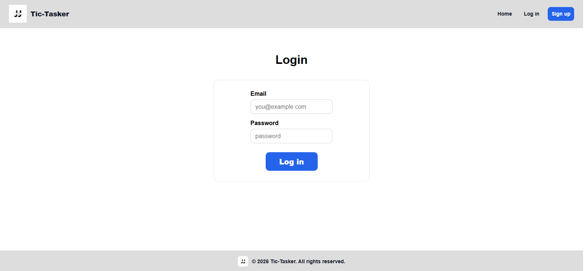
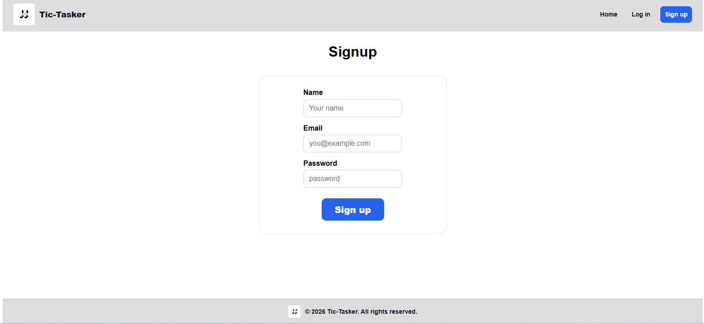

# Tic-Tasker Frontend

Tic-Tasker is a full-stack MERN (MongoDB, Express, React, Node.js) task and project management application.
The frontend is built with React and Vite and serves as the primary user interface for interacting with the system. It handles user authentication flows, project and task management, and real-time UI state updates, while communicating with a secure RESTful API.

The client application is designed with a mobile-first, responsive architecture, ensuring consistent usability across desktop, tablet, and mobile devices. It integrates JWT-based authentication, protected routes, and centralized API communication to provide a scalable and maintainable frontend layer suitable for production environments.

---

## Author

Jackson Jacque

---

## Live Link

- Frontend: Add later

---

## Screenshots





---

## How to Run the Frontend

### 1. Install dependencies

```
bash
npm install

```

### 2. Environment variables

- Create a .env file in /client:
  - VITE_API_URL=http://localhost:3000

### 3. Start development server

```npm run dev

```

Frontend will run at: http://localhost:5173

## How to Use the App

1. Visit the Home page

2. Sign up for a new account

3. Log in

4. Create projects from the dashboard

5. Open a project to:

6. Add tasks

7. Set task status (To Do / In Progress / Done)

8. Delete tasks

9. Log out securely

## Technologies Used

- React

- Vite

- React Router DOM

- Context API

- Fetch API

- CSS (mobile-first, responsive)

- JWT-based authentication (via backend)

## Key Dependencies

- react
- react-router-dom

## Authentication Handling

- JWT token stored securely in localStorage

- Automatically attached to API requests

- Protected routes redirect unauthenticated users

## Responsive Design

- Mobile-first approach

- Adaptive layouts for:
  - Phones

  - Tablets

  - Desktop

- Navigation and footer adapt per screen size

## Live Overview

The frontend communicates with a RESTful backend API to:

- Authenticate users
- Create and manage projects
- Create, update, and delete tasks
- Display task status updates in real time

The UI is fully responsive and optimized for:

- Desktop
- Tablets
- Large & small mobile devices

---

## Future Enhancements

- Dark mode

- Drag-and-drop tasks

- Task due dates

- User profile settings

- Analytics dashboard

## Planning & Execution

### Planning

The frontend was designed with:

- Mobile-first responsiveness
- Clear separation of pages and reusable components
- Scalable folder structure
- Authentication-aware routing

Key planning decisions:

- Use **Vite + React** for fast development
- Centralize API logic in a single utility
- Use Context API for authentication state
- Keep UI clean, readable, and accessible

### Execution

- Pages built first (Home, Login, Signup, Dashboard, Project Page)
- Reusable components extracted (Navbar, Footer, ProjectsPanel)
- Styling applied incrementally with scoped CSS
- Responsiveness added using media queries
- Final polish for production-readiness

---

## Frontend Folder Structure

```
client/
  src/
    assets/
      JJ.logo.PNG
      hero.png

    components/
      Navbar.jsx
      Footer.jsx
      Projects.jsx

    context/
      authContext.jsx

    pages/
      Home.jsx
      Login.jsx
      Signup.jsx
      Dashboard.jsx
      ProjectPage.jsx

    util/
      api.js

    App.jsx
    main.jsx
    index.css

  public/
  .env
  index.html
  package.json
  vite.config.js
  README.md

```

## Frontend Folder Structure Insight

- assets/ – static images and branding

- components/ – reusable UI (Navbar, Footer, Projects panel)

- context/ – global authentication state (JWT, user session)

- pages/ – route-level screens

- util/ – centralized API logic (clean + maintainable)

- App.jsx – app layout and routing

- main.jsx – React entry point

- index.css – global styles

- .env – environment variables

- vite.config.js – build tooling

- README.md – frontend documentation
